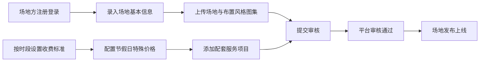
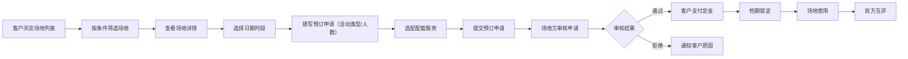

## 1. 产品概述

本产品是一个面向外部商业场地的活动场地预订平台，连接场地方与客户方，解决商业场地（宴会厅、展览馆、户外场地等）的在线预订与管理问题。目标是打造一个高效、透明、专业的商业场地租赁生态。

## 2. 核心 Features

### 2.1 用户角色

| 角色 | 注册方式 | 核心权限 |
|------|----------|----------|
| 场地方 | 手机号/邮箱注册 | 录入场地信息、配置价格、审核预订、管理配套服务、查看数据统计 |
| 客户方 | 手机号/邮箱注册 | 浏览场地、筛选搜索、提交预订申请、选配服务、支付定金、评价场地 |
| 平台管理员 | 后台账号登录 | 审核场地、管理用户、查看全平台数据统计 |

### 2.2 Feature Module

1. **首页**：场地推荐、热门分类、快速筛选、轮播Banner
2. **场地列表页**：多维度筛选、排序、场地卡片展示
3. **场地详情页**：场地信息、图集展示、价格日历、配套服务、预订表单
4. **场地方管理中心**：场地管理、价格配置、订单管理、服务管理、评价管理、数据统计
5. **客户方个人中心**：我的预订、我的收藏、我的评价、账户信息
6. **后台管理系统**：用户管理、场地审核、订单监控、数据大盘

### 2.3 Page Details

| 页面名称 | 模块名称 | Feature description |
|----------|----------|---------------------|
| 首页 | 智能推荐 | 根据用户偏好推荐热门场地，支持城市、类型快速筛选 |
| 首页 | 搜索组件 | 关键词搜索、城市选择、日期选择、人数选择 |
| 首页 | 场地分类 | 宴会厅、展览馆、户外场地、会议中心等分类入口 |
| 场地列表页 | 筛选面板 | 城市、价格区间、容量、场地类型、设施配置筛选 |
| 场地列表页 | 排序功能 | 按价格、评分、预订量、面积排序 |
| 场地列表页 | 场地卡片 | 封面图、名称、位置、容量、起价、评分、标签 |
| 场地详情页 | 场地信息 | 面积、容量、层高、地址、联系方式、设施配置 |
| 场地详情页 | 图集展示 | 场地实景图、不同布置风格图集轮播 |
| 场地详情页 | 价格日历 | 日历展示可预订日期及对应价格，区分工作日/周末/节假日 |
| 场地详情页 | 配套服务 | 餐饮套餐、音响设备、布置服务等可选项 |
| 场地详情页 | 预订表单 | 选择时段、填写活动类型、预估人数、特殊需求 |
| 场地方管理中心 | 场地管理 | 新增/编辑/下架场地，管理场地信息与图集 |
| 场地方管理中心 | 价格配置 | 按时段设置基础价格，单独配置节假日价格 |
| 场地方管理中心 | 订单管理 | 查看预订申请、审核确认档期、查看支付状态 |
| 场地方管理中心 | 服务管理 | 配置配套服务项目与价格 |
| 场地方管理中心 | 评价管理 | 查看客户评价、回复评价 |
| 场地方管理中心 | 数据统计 | 预订率统计、收入来源分析、客户活动类型分布 |
| 客户方个人中心 | 我的预订 | 查看预订状态、支付定金、申请取消、评价入口 |
| 客户方个人中心 | 账单明细 | 场地费用、服务费用、定金支付记录 |
| 后台管理系统 | 数据大盘 | 全平台预订数据、收入趋势、热门场地排行 |

## 3. 核心 Process

### 3.1 场地发布流程

### 3.2 预订流程

## 4. User Interface Design

### 4.1 设计风格

- **主色调**：深靛蓝 #1E3A5F（专业、稳重）
- **辅助色**：琥珀金 #D4AF37（高端、品质）
- **强调色**：珊瑚橙 #FF6B35（活力、行动号召）
- **中性色**：象牙白 #FAFAF5、深灰 #2C2C2C、中灰 #6B6B6B
- **按钮风格**：微圆角（8px），悬停时轻微上浮+阴影加深
- **字体**：标题使用"Playfair Display"（优雅衬线），正文使用"Noto Sans SC"（清晰易读）
- **布局风格**：卡片式布局，大量留白，强调视觉层次
- **图标风格**：线性图标，统一2px描边，圆角端点

### 4.2 页面设计 Overview

| 页面名称 | 模块名称 | UI Elements |
|----------|----------|-------------|
| 首页 | Hero区 | 全屏背景图+半透明遮罩，大字标题，搜索框居中悬浮 |
| 首页 | 分类导航 | 图标+文字卡片，悬停放大动画 |
| 首页 | 推荐场地 | 横向滑动卡片，3D视差效果 |
| 场地列表页 | 筛选面板 | 左侧固定侧边栏，可折叠，多条件级联筛选 |
| 场地列表页 | 场地卡片 | 不规则圆角卡片，底部渐变遮罩显示价格，悬停显示更多操作 |
| 场地详情页 | 图集轮播 | 大图轮播+缩略图导航，过渡动画 |
| 场地详情页 | 价格日历 | 日历格子根据价格区间显示不同色阶，悬停显示详情 |
| 场地详情页 | 配套服务 | 可勾选服务卡片，价格实时汇总 |
| 场地方管理中心 | 数据看板 | 卡片式数据指标，趋势图+饼图+柱状图 |
| 场地方管理中心 | 价格配置 | 时间轴式价格分段设置，节假日高亮标记 |

### 4.3 响应式设计

- **Desktop-first** 设计，自适应响应式布局
- 断点：1440px（大屏）、1024px（平板横屏）、768px（平板竖屏）、480px（手机）
- 移动端优化：侧边栏转为底部抽屉，卡片堆叠展示，触摸友好的按钮尺寸（≥44px）

### 4.4 动效设计

- 页面加载：元素错峰入场，延迟0-300ms，淡入+上移组合
- 卡片悬停： translateY(-4px) + box-shadow加深，300ms cubic-bezier(0.4, 0, 0.2, 1)
- 筛选切换：高度平滑过渡，内容淡入淡出
- 按钮交互：点击时scale(0.96)，释放后回弹
- 日历切换：月份左右滑动切换，新内容滑入
