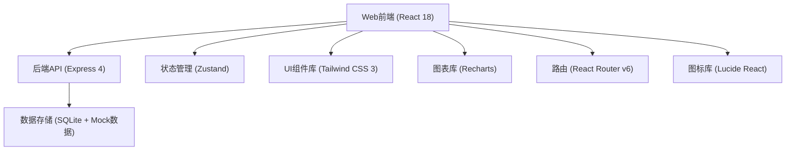
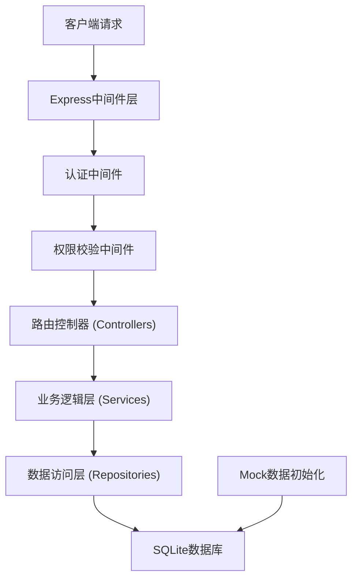
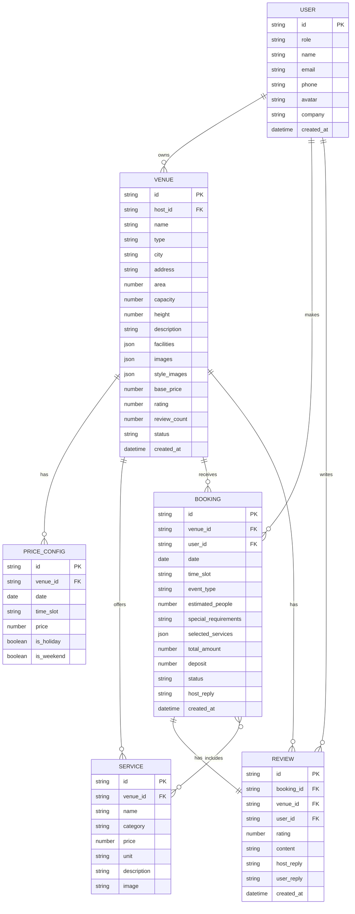

## 1. 架构 Design



## 2. 技术 Description

- **前端**：React@18 + TypeScript + Vite@5 + TailwindCSS@3 + Zustand@4 + React Router@6 + Recharts@2 + Lucide React@0.344
- **后端**：Express@4 + TypeScript
- **数据库**：SQLite（本地开发）+ Mock数据初始化
- **初始化工具**：vite-init
- **项目模板**：react-express-ts（React + Express + TypeScript）

## 3. 路由 Definitions

| Route | Purpose |
|-------|---------|
| `/` | 首页 - 场地推荐、搜索入口、分类导航 |
| `/venues` | 场地列表页 - 筛选、排序、场地卡片 |
| `/venues/:id` | 场地详情页 - 图集、价格日历、预订表单 |
| `/host/dashboard` | 场地方管理中心 - 数据看板 |
| `/host/venues` | 场地方 - 场地列表管理 |
| `/host/venues/new` | 场地方 - 新增场地 |
| `/host/venues/:id/edit` | 场地方 - 编辑场地 |
| `/host/venues/:id/pricing` | 场地方 - 价格配置 |
| `/host/orders` | 场地方 - 订单管理 |
| `/host/services` | 场地方 - 配套服务管理 |
| `/host/reviews` | 场地方 - 评价管理 |
| `/host/analytics` | 场地方 - 数据统计分析 |
| `/user/bookings` | 客户方 - 我的预订 |
| `/user/favorites` | 客户方 - 我的收藏 |
| `/user/reviews` | 客户方 - 我的评价 |
| `/login` | 登录页 |
| `/register` | 注册页 |
| `/admin/dashboard` | 后台管理 - 数据大盘 |

## 4. API Definitions

```typescript
// 场地相关
interface Venue {
  id: string;
  name: string;
  type: 'banquet' | 'exhibition' | 'outdoor' | 'conference' | 'other';
  city: string;
  address: string;
  area: number;
  capacity: number;
  height: number;
  description: string;
  facilities: string[];
  images: string[];
  styleImages: { name: string; url: string }[];
  basePrice: number;
  rating: number;
  reviewCount: number;
  status: 'draft' | 'pending' | 'published' | 'offline';
  hostId: string;
  createdAt: string;
}

// 价格配置
interface PriceConfig {
  id: string;
  venueId: string;
  date: string;
  timeSlot: 'morning' | 'afternoon' | 'evening' | 'fullDay';
  price: number;
  isHoliday: boolean;
  isWeekend: boolean;
}

// 配套服务
interface Service {
  id: string;
  venueId: string;
  name: string;
  category: 'catering' | 'audio' | 'decoration' | 'other';
  price: number;
  unit: string;
  description: string;
  image?: string;
}

// 预订订单
interface Booking {
  id: string;
  venueId: string;
  userId: string;
  date: string;
  timeSlot: 'morning' | 'afternoon' | 'evening' | 'fullDay';
  eventType: string;
  estimatedPeople: number;
  specialRequirements?: string;
  selectedServices: { serviceId: string; quantity: number }[];
  totalAmount: number;
  deposit: number;
  status: 'pending' | 'approved' | 'rejected' | 'depositPaid' | 'confirmed' | 'completed' | 'cancelled';
  hostReply?: string;
  createdAt: string;
}

// 评价
interface Review {
  id: string;
  bookingId: string;
  venueId: string;
  userId: string;
  rating: number;
  content: string;
  hostReply?: string;
  userReply?: string;
  createdAt: string;
}

// 用户
interface User {
  id: string;
  role: 'host' | 'customer' | 'admin';
  name: string;
  email: string;
  phone: string;
  avatar?: string;
  company?: string;
}

// API请求响应类型
interface ApiResponse<T> {
  success: boolean;
  data?: T;
  message?: string;
  total?: number;
}

interface PaginationParams {
  page: number;
  pageSize: number;
}

interface VenueFilterParams {
  city?: string;
  type?: string;
  minPrice?: number;
  maxPrice?: number;
  minCapacity?: number;
  maxCapacity?: number;
  date?: string;
  facilities?: string[];
  keyword?: string;
  sortBy?: 'price' | 'rating' | 'bookings' | 'area';
  sortOrder?: 'asc' | 'desc';
}
```

### API Endpoints

```typescript
// 场地
GET /api/venues - 获取场地列表（支持筛选）
GET /api/venues/:id - 获取场地详情
POST /api/venues - 创建场地
PUT /api/venues/:id - 更新场地
DELETE /api/venues/:id - 删除场地

// 价格配置
GET /api/venues/:id/pricing - 获取场地价格日历
POST /api/venues/:id/pricing - 批量设置价格
PUT /api/pricing/:id - 更新价格配置
DELETE /api/pricing/:id - 删除价格配置

// 配套服务
GET /api/venues/:id/services - 获取场地配套服务
POST /api/venues/:id/services - 添加配套服务
PUT /api/services/:id - 更新配套服务
DELETE /api/services/:id - 删除配套服务

// 预订订单
GET /api/bookings - 获取预订列表
GET /api/bookings/:id - 获取预订详情
POST /api/bookings - 创建预订申请
PUT /api/bookings/:id/status - 更新预订状态（审核/支付）
POST /api/bookings/:id/pay-deposit - 支付定金

// 评价
GET /api/venues/:id/reviews - 获取场地评价
POST /api/reviews - 创建评价
PUT /api/reviews/:id/reply - 回复评价

// 用户
POST /api/auth/login - 登录
POST /api/auth/register - 注册
GET /api/user/profile - 获取用户信息
PUT /api/user/profile - 更新用户信息

// 统计数据
GET /api/host/analytics/booking-rate - 预订率统计
GET /api/host/analytics/revenue - 收入来源分析
GET /api/host/analytics/event-types - 活动类型分布
GET /api/admin/analytics/overview - 后台数据大盘
```

## 5. 服务器 Architecture



## 6. 数据 Model

### 6.1 数据模型 Definition



### 6.2 DDL 语句

```sql
-- 用户表
CREATE TABLE users (
    id TEXT PRIMARY KEY,
    role TEXT NOT NULL CHECK (role IN ('host', 'customer', 'admin')),
    name TEXT NOT NULL,
    email TEXT UNIQUE NOT NULL,
    phone TEXT,
    avatar TEXT,
    company TEXT,
    created_at DATETIME DEFAULT CURRENT_TIMESTAMP
);

-- 场地表
CREATE TABLE venues (
    id TEXT PRIMARY KEY,
    host_id TEXT NOT NULL,
    name TEXT NOT NULL,
    type TEXT NOT NULL CHECK (type IN ('banquet', 'exhibition', 'outdoor', 'conference', 'other')),
    city TEXT NOT NULL,
    address TEXT NOT NULL,
    area REAL NOT NULL,
    capacity INTEGER NOT NULL,
    height REAL,
    description TEXT,
    facilities JSON,
    images JSON,
    style_images JSON,
    base_price REAL NOT NULL,
    rating REAL DEFAULT 0,
    review_count INTEGER DEFAULT 0,
    status TEXT NOT NULL DEFAULT 'draft' CHECK (status IN ('draft', 'pending', 'published', 'offline')),
    created_at DATETIME DEFAULT CURRENT_TIMESTAMP,
    FOREIGN KEY (host_id) REFERENCES users(id)
);

-- 价格配置表
CREATE TABLE price_configs (
    id TEXT PRIMARY KEY,
    venue_id TEXT NOT NULL,
    date TEXT NOT NULL,
    time_slot TEXT NOT NULL CHECK (time_slot IN ('morning', 'afternoon', 'evening', 'fullDay')),
    price REAL NOT NULL,
    is_holiday INTEGER DEFAULT 0,
    is_weekend INTEGER DEFAULT 0,
    FOREIGN KEY (venue_id) REFERENCES venues(id),
    UNIQUE(venue_id, date, time_slot)
);

-- 配套服务表
CREATE TABLE services (
    id TEXT PRIMARY KEY,
    venue_id TEXT NOT NULL,
    name TEXT NOT NULL,
    category TEXT NOT NULL CHECK (category IN ('catering', 'audio', 'decoration', 'other')),
    price REAL NOT NULL,
    unit TEXT NOT NULL,
    description TEXT,
    image TEXT,
    FOREIGN KEY (venue_id) REFERENCES venues(id)
);

-- 预订订单表
CREATE TABLE bookings (
    id TEXT PRIMARY KEY,
    venue_id TEXT NOT NULL,
    user_id TEXT NOT NULL,
    date TEXT NOT NULL,
    time_slot TEXT NOT NULL CHECK (time_slot IN ('morning', 'afternoon', 'evening', 'fullDay')),
    event_type TEXT NOT NULL,
    estimated_people INTEGER NOT NULL,
    special_requirements TEXT,
    selected_services JSON,
    total_amount REAL NOT NULL,
    deposit REAL NOT NULL,
    status TEXT NOT NULL DEFAULT 'pending' CHECK (status IN ('pending', 'approved', 'rejected', 'depositPaid', 'confirmed', 'completed', 'cancelled')),
    host_reply TEXT,
    created_at DATETIME DEFAULT CURRENT_TIMESTAMP,
    FOREIGN KEY (venue_id) REFERENCES venues(id),
    FOREIGN KEY (user_id) REFERENCES users(id)
);

-- 评价表
CREATE TABLE reviews (
    id TEXT PRIMARY KEY,
    booking_id TEXT NOT NULL UNIQUE,
    venue_id TEXT NOT NULL,
    user_id TEXT NOT NULL,
    rating INTEGER NOT NULL CHECK (rating >= 1 AND rating <= 5),
    content TEXT,
    host_reply TEXT,
    user_reply TEXT,
    created_at DATETIME DEFAULT CURRENT_TIMESTAMP,
    FOREIGN KEY (booking_id) REFERENCES bookings(id),
    FOREIGN KEY (venue_id) REFERENCES venues(id),
    FOREIGN KEY (user_id) REFERENCES users(id)
);

-- 索引
CREATE INDEX idx_venues_city ON venues(city);
CREATE INDEX idx_venues_type ON venues(type);
CREATE INDEX idx_venues_status ON venues(status);
CREATE INDEX idx_price_configs_venue_date ON price_configs(venue_id, date);
CREATE INDEX idx_bookings_venue_date ON bookings(venue_id, date);
CREATE INDEX idx_bookings_user ON bookings(user_id);
CREATE INDEX idx_reviews_venue ON reviews(venue_id);
```

### 6.3 Mock 初始数据

```typescript
// Mock用户数据
const mockUsers = [
  { id: 'host1', role: 'host', name: '华盛宴会厅', email: 'host1@venue.com', phone: '13800138001', company: '华盛酒店管理集团' },
  { id: 'host2', role: 'host', name: '会展中心', email: 'host2@venue.com', phone: '13800138002', company: '国际会展有限公司' },
  { id: 'cust1', role: 'customer', name: '张先生', email: 'cust1@test.com', phone: '13900139001' },
  { id: 'cust2', role: 'customer', name: '李女士', email: 'cust2@test.com', phone: '13900139002' },
  { id: 'admin1', role: 'admin', name: '平台管理员', email: 'admin@venue.com', phone: '13000130001' },
];

// Mock场地数据
const mockVenues = [
  {
    id: 'venue1',
    hostId: 'host1',
    name: '华盛水晶宴会厅',
    type: 'banquet',
    city: '上海',
    address: '浦东新区陆家嘴环路1000号',
    area: 1200,
    capacity: 500,
    height: 8,
    description: '五星级酒店宴会厅，可承办婚宴、年会、发布会等各类大型活动',
    facilities: ['舞台', '灯光', '音响', '投影', '化妆间', '停车场', 'WIFI'],
    images: [
      'https://trae-api-cn.mchost.guru/api/ide/v1/text_to_image?prompt=luxury%20banquet%20hall%20with%20crystal%20chandeliers%20elegant%20interior&image_size=square_hd',
      'https://trae-api-cn.mchost.guru/api/ide/v1/text_to_image?prompt=grand%20ballroom%20wedding%20venue%20interior%20design&image_size=square_hd',
    ],
    styleImages: [
      { name: '中式婚礼', url: 'https://trae-api-cn.mchost.guru/api/ide/v1/text_to_image?prompt=chinese%20traditional%20wedding%20venue%20decoration%20red%20theme&image_size=square_hd' },
      { name: '西式婚礼', url: 'https://trae-api-cn.mchost.guru/api/ide/v1/text_to_image?prompt=western%20wedding%20venue%20white%20flowers%20elegant&image_size=square_hd' },
      { name: '企业年会', url: 'https://trae-api-cn.mchost.guru/api/ide/v1/text_to_image?prompt=corporate%20annual%20gala%20dinner%20stage%20lighting&image_size=square_hd' },
    ],
    basePrice: 28000,
    rating: 4.8,
    reviewCount: 56,
    status: 'published',
  },
  // ... 更多Mock场地数据
];
```
